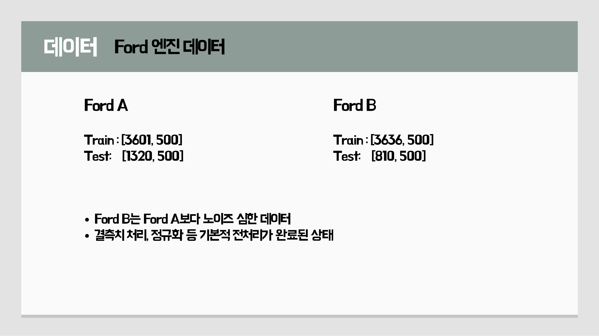
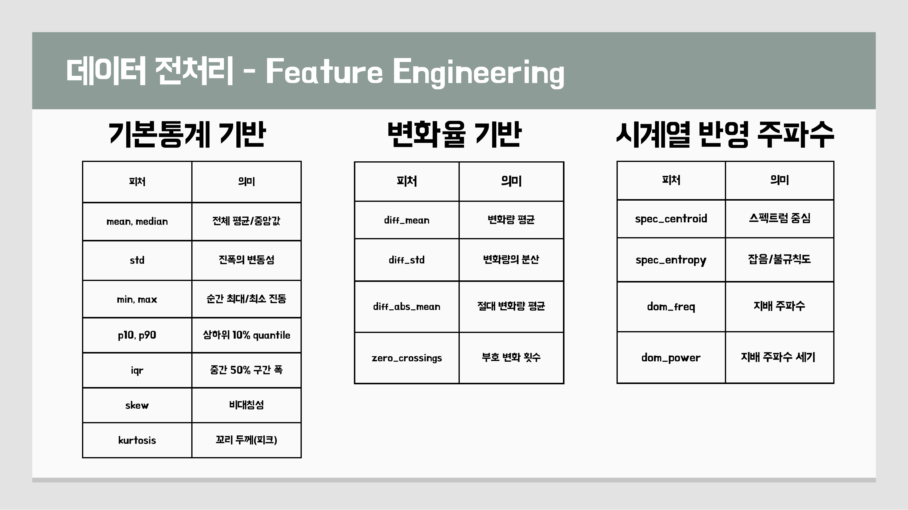
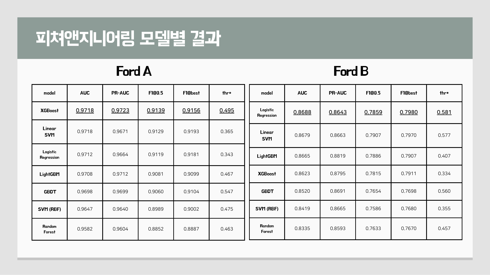
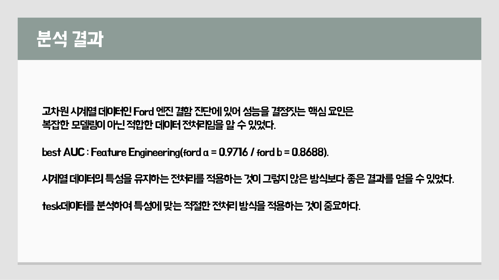

# Ford Engine Fault Detection

Ford 엔진 시계열 센서 데이터를 활용해 엔진 이상 여부를 분류하는 산업데이터 분석 프로젝트입니다.

500차원 시계열 데이터를 그대로 사용하는 방식, PCA 차원 축소 방식, 통계/변화율/주파수 기반 Feature Engineering 방식의 성능을 비교했고, 여러 머신러닝 모델을 통해 전처리 방식별 성능 차이를 분석했습니다.


## Project Summary

| 항목 | 내용 |
| --- | --- |
| 프로젝트명 | Ford Engine Fault Detection |
| 주제 | Ford 엔진 시계열 데이터 기반 이상 탐지 |
| 분야 | 산업데이터 분석, 시계열 분류, 예지보전 |
| 데이터 | FordA, FordB engine dataset |
| 목표 | 정상/이상 엔진 상태 이진 분류 |
| 핵심 방법 | Raw, PCA, Feature Engineering 비교 |
| 평가 지표 | AUC, PR-AUC, F1 Score |

## Dataset

Ford 엔진 데이터는 각 샘플이 500개의 연속 측정값으로 구성된 시계열 데이터입니다.

```text
label, time_1, time_2, ..., time_500
```



데이터 구성:

- Label: `-1` 또는 `1`
- FordA Train: 3,601 samples
- FordA Test: 1,320 samples
- FordB Train: 3,636 samples
- FordB Test: 810 samples
- FordB는 FordA보다 노이즈가 큰 데이터로 분석했습니다.

## Approach

### 1. Raw Data

500차원 시계열 데이터를 그대로 입력해 모델을 학습했습니다. 원본 정보를 유지할 수 있지만, 고차원 노이즈와 모델별 민감도 문제가 있었습니다.

### 2. PCA

고차원 시계열 입력을 PCA로 축소했습니다.

- FordA: 500차원 -> 66차원
- FordB: 500차원 -> 72차원

### 3. Feature Engineering

시계열의 통계적 특성, 변화율, 자기상관, 주파수 특성을 추출해 24개 tabular feature로 변환했습니다.



주요 feature:

- 기본 통계: mean, median, std, min, max, p10, p90, iqr
- 분포 특성: skew, kurtosis
- 변화율: diff_mean, diff_std, diff_abs_mean
- 시계열 특성: zero_crossings, acf_lag1, acf_lag5, acf_lag10, acf_lag20, acf_lag50, slope
- 주파수 특성: spec_centroid, spec_entropy, dom_freq, dom_power

## Models

다음 모델을 동일한 평가 지표로 비교했습니다.

- Logistic Regression
- Linear SVM
- SVM with RBF Kernel
- Random Forest
- Gradient Boosting Decision Tree
- LightGBM
- XGBoost

## Results

발표자료 기준 가장 좋은 성능은 Feature Engineering 방식에서 나왔습니다.



| 데이터 | Best AUC | Best Model | 방식 |
| --- | ---: | --- | --- |
| FordA | 0.9718 | XGBoost / Linear SVM | Feature Engineering |
| FordB | 0.8688 | Logistic Regression | Feature Engineering |

Raw 데이터와 PCA만 사용할 때보다 Feature Engineering을 적용했을 때 모델 평균 성능이 크게 향상되었습니다. 특히 FordB처럼 노이즈가 큰 데이터에서도 feature 기반 접근이 안정적인 성능을 보였습니다.

## Key Insight

Ford 엔진 결함 진단에서는 복잡한 모델링 자체보다 **시계열 특성을 보존하는 적절한 전처리**가 성능을 결정하는 핵심 요인이었습니다.



주요 해석:

- Raw -> PCA -> Feature Engineering 순서로 성능이 상승했습니다.
- Feature Engineering 적용 후 선형 모델 성능도 크게 개선되었습니다.
- 이는 생성한 feature들이 결함 분류 문제를 더 선형적으로 분리 가능하게 만들었기 때문으로 해석했습니다.
- 중요 변수로는 `acf_lag10`, `acf_lag50`, `acf_lag5`, `dom_freq`, `spec_entropy` 등이 반복적으로 나타났습니다.

## Folder Structure

```text
ford-engine-timeseries-portfolio/
├─ README.md
├─ requirements.txt
├─ src/
│  ├─ preprocessing.py
│  ├─ data_preprocess.py
│  ├─ multi_model.py
│  ├─ logistic_regression.py
│  ├─ logistic_regression_label.py
│  └─ split.py
└─ docs/
   ├─ presentation/
   │  └─ 산업데이터분석팀프로젝트.pdf
   └─ images/
```

## Main Code

- `preprocessing.py`: FordA 데이터 로드 및 feature 추출
- `data_preprocess.py`: FordB 데이터 feature 추출
- `multi_model.py`: 여러 분류 모델 학습 및 성능 비교
- `logistic_regression.py`: Logistic Regression baseline 평가
- `split.py`: 데이터 분할 보조 스크립트

## How to Run

필요 패키지 설치:

```bash
pip install -r requirements.txt
```

Feature Engineering 데이터 생성:

```bash
python src/preprocessing.py --train FordA_TRAIN.txt --test FordA_TEST.txt --outdir .
```

모델 비교 실행:

```bash
python src/multi_model.py
```

## Portfolio Points

- 500차원 시계열 데이터를 산업 설비 이상 탐지 문제로 해석했습니다.
- Raw, PCA, Feature Engineering을 비교해 전처리 전략의 효과를 분석했습니다.
- 통계/변화율/자기상관/주파수 feature를 직접 설계했습니다.
- 여러 머신러닝 모델을 동일 지표로 비교하고, threshold 조정 기반 F1 Score도 함께 확인했습니다.
- 단순 모델 성능 비교를 넘어 “왜 Feature Engineering이 유효했는가”를 주요 변수 분석으로 설명했습니다.

## Recommended Repository Name

```text
ford-engine-fault-detection
```
