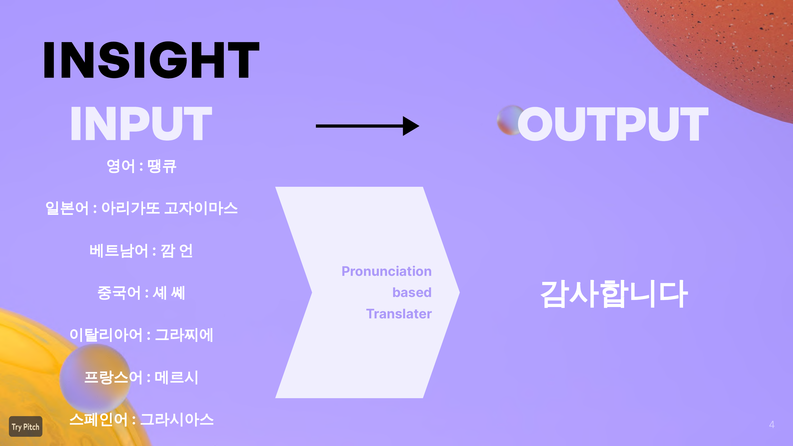
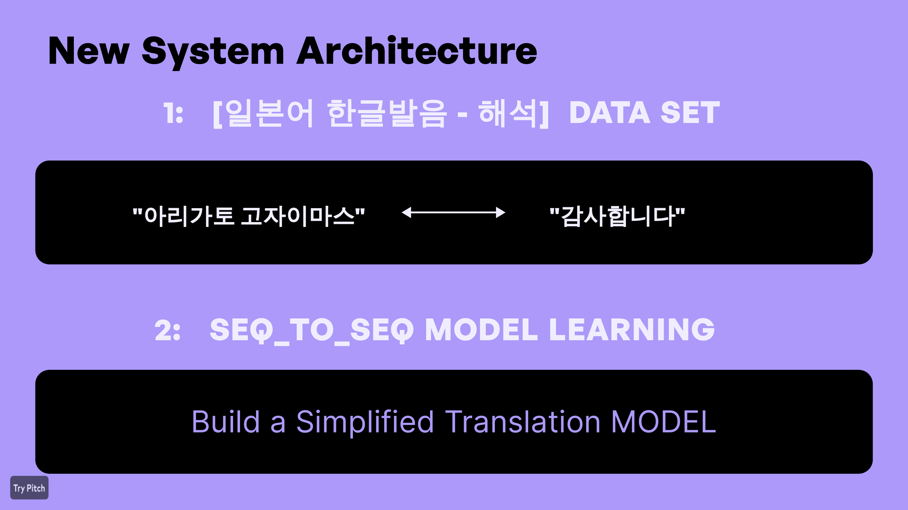
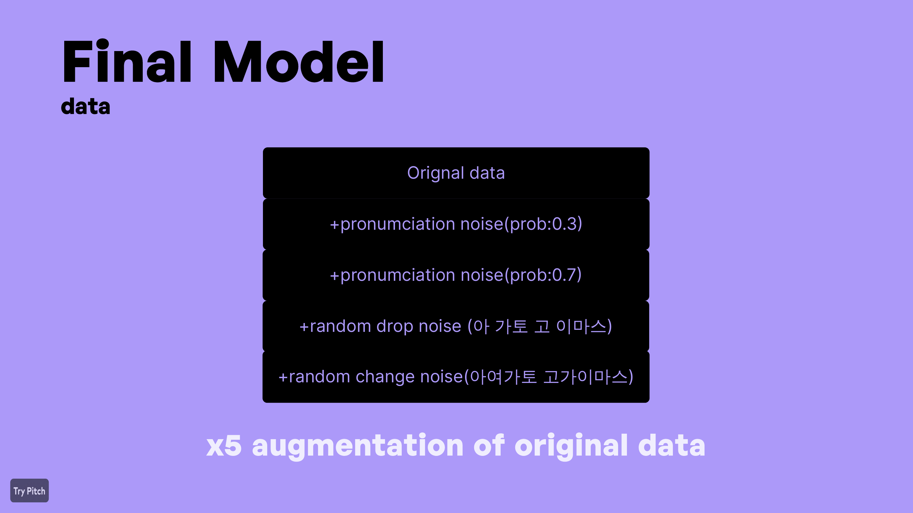
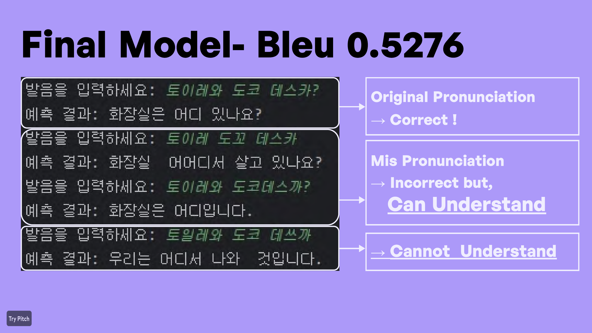

# Pronunciation-Based Japanese Translator

일본어를 직접 입력하기 어려운 상황에서, 사용자가 들리는 일본어 발음을 한글로 입력하면 한국어 의미를 예측하는 문자 단위 Seq2Seq 기반 번역 모델 프로젝트입니다.

기존 번역 API 결과를 그대로 보여주는 방식이 아니라, 일본어 문장 - 한글 발음 - 한국어 의미 데이터를 구성하고 PyTorch 기반 Encoder-Decoder 모델을 직접 학습해 발음 입력에서 의미를 생성하는 흐름을 구현했습니다.


## Project Summary

| 항목 | 내용 |
| --- | --- |
| 프로젝트명 | Pronunciation-Based Japanese Translator |
| 주제 | 한글 발음 입력 기반 일본어 의미 예측 |
| 분야 | NLP, Seq2Seq, Machine Translation |
| 핵심 기술 | PyTorch, GRU, Attention, BLEU |
| 구현 범위 | 데이터 수집, 전처리, 증강, 학습, 검증, 추론 |
| 최종 성능 | BLEU 0.5276 |
| 산출물 | 모델 코드, 발표자료 PDF/PPT |

## Problem

외국어 문장을 들었지만 정확한 문자 입력이 어려운 상황이 있습니다. 예를 들어 일본어 문장을 정확히 입력하지 못해도, 사용자가 들리는 대로 한글 발음으로 입력하면 의미를 추정할 수 있는 모델을 목표로 했습니다.



## Key Idea

초기 구조는 다음과 같은 3단계 방식이었습니다.

```text
Korean pronunciation
    -> Romanized text
    -> Japanese text
    -> Korean meaning
```

하지만 중간 변환 과정에서 노이즈가 커지고, 모델 결과가 안정적이지 않아 구조를 단순화했습니다.

최종 방향은 다음과 같습니다.

```text
Korean pronunciation input
    -> Seq2Seq with Attention
    -> Korean meaning output
```



## Model Architecture

```text
Korean pronunciation input
        |
        v
CharVocab encoding
        |
        v
GRU Encoder
        |
        v
Attention Decoder
        |
        v
Korean meaning output
```

모델 구성:

- `Encoder`: 입력 발음 시퀀스를 GRU hidden state로 인코딩
- `Attention`: Decoder가 출력 시점마다 입력 시퀀스의 주요 위치를 참조
- `AttentionDecoder`: 이전 출력과 attention context를 바탕으로 다음 문자를 예측
- `Seq2Seq`: Encoder와 Decoder를 연결하고 Teacher Forcing 기반 학습 수행

## Data Augmentation

표준 발음에만 과적합되는 문제를 줄이기 위해 발음 노이즈를 추가했습니다.



적용한 증강:

- 발음 변형 노이즈
- 랜덤 삭제
- 랜덤 치환
- 원본 데이터 기준 5배 증강

## Results

발표자료 기준 최종 모델의 BLEU Score는 `0.5276`입니다.



결과 해석:

- 표준 발음 입력에 대해서는 비교적 안정적으로 의미를 예측했습니다.
- 일부 오입력 발음에 대해서도 의미를 추정할 수 있었습니다.
- 다만 노이즈가 과도한 입력은 일반화가 어려워, 데이터 품질과 증강 강도 조절이 중요했습니다.

## Use Case

사용자가 외국어 문장을 들었지만 정확한 원문을 모를 때, 한글로 들리는 발음을 입력해 의미를 확인하는 상황을 가정했습니다.


예시:

```text
입력: 코코니 스와 테쿠다사이
출력: 여기에 앉아 주세요
```

## Folder Structure

```text
pronunciation-translator-portfolio/
├─ README.md
├─ model/
│  ├─ seq2seq.py
│  ├─ train.py
│  ├─ eval.py
│  ├─ infer.py
│  └─ dialog_transation.py
├─ utility/
│  ├─ utils.py
│  └─ daraset-tuning.py
└─ docs/
   ├─ presentation/
   │  ├─ 기말과제_발음기반_번역기.pdf
   │  └─ 발음톡_서비스_화면설계_포트폴리오.pptx
   └─ images/
```

## Main Code

- `model/seq2seq.py`: Encoder, Attention, AttentionDecoder, Seq2Seq 모델 정의
- `model/train.py`: 학습 루프, 검증 BLEU 계산, Early Stopping
- `model/eval.py`: 테스트 데이터 평가
- `model/infer.py`: 학습된 모델 기반 CLI 추론
- `model/dialog_transation.py`: Papago 기반 발음/번역 데이터 수집 보조
- `utility/utils.py`: 문자 Vocabulary와 Dataset 클래스

## How to Run

학습:

```bash
cd "seq2seq_2025_0528 (1)/model"
python train.py
```

추론:

```bash
cd "seq2seq_2025_0528 (1)/model"
python infer.py
```

평가:

```bash
cd "seq2seq_2025_0528 (1)/model"
python eval.py
```

## Portfolio Points

- 번역 API 호출에만 의존하지 않고, 직접 Seq2Seq 모델 구조를 구현했습니다.
- 발음 기반 입력을 문자 단위 데이터로 모델링했습니다.
- Attention 구조를 적용해 입력 시퀀스와 출력 시퀀스 간 대응 관계를 반영했습니다.
- BLEU Score와 Early Stopping으로 모델 성능을 검증했습니다.
- Selenium/Papago를 활용해 학습 데이터 구성 과정을 자동화했습니다.
- 표준 발음 과적합 문제를 발견하고, 노이즈 증강으로 개선을 시도했습니다.

## Recommended Repository Name

```text
pronunciation-based-japanese-translator
```
