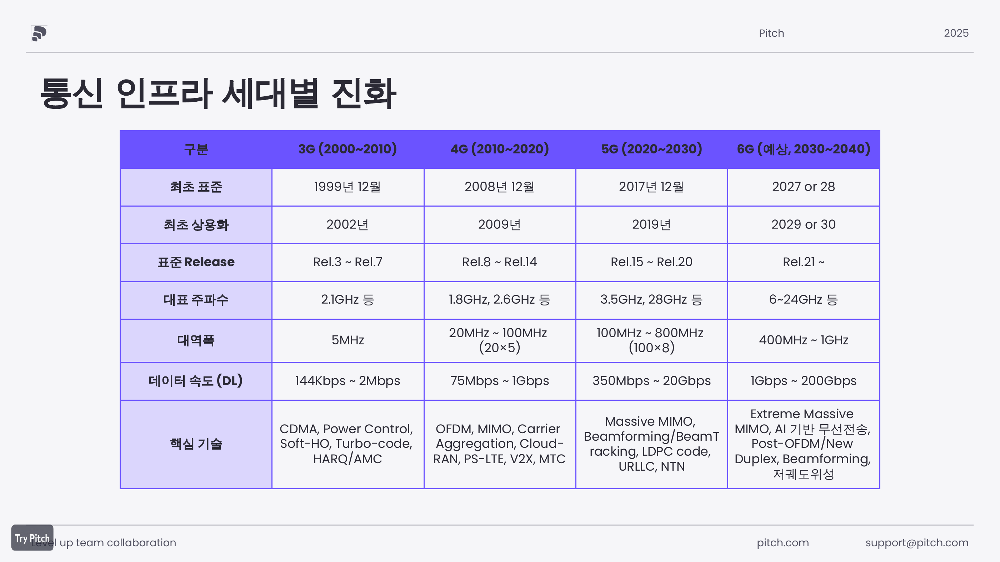
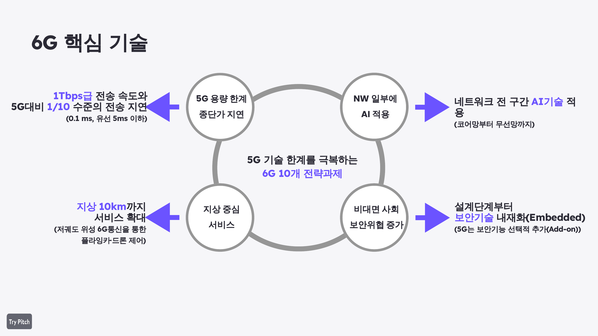
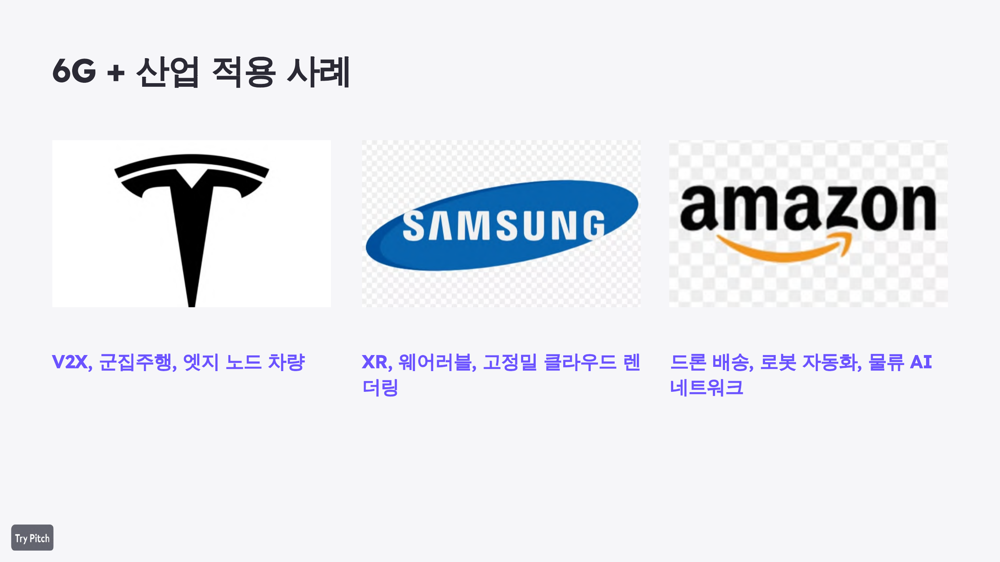
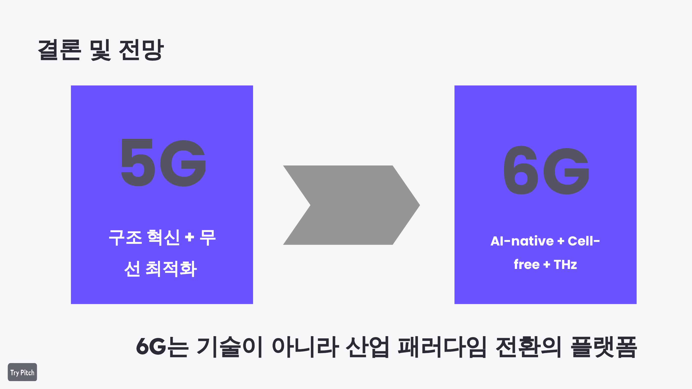

# 5G to 6G Network Evolution

5G 통신 인프라의 핵심 기술과 한계를 분석하고, 6G 네트워크가 어떤 방향으로 발전하는지 정리한 네트워크 기술 조사 프로젝트입니다.


## Project Summary

| 항목 | 내용 |
| --- | --- |
| 프로젝트명 | 5G to 6G Network Evolution |
| 주제 | 5G에서 6G로의 통신 인프라 진화 |
| 분야 | 네트워크, 이동통신, 차세대 통신 인프라 |
| 역할 | 팀장, 자료조사, PPT 제작, 발표 |
| 산출물 | 발표자료 PDF, 포트폴리오 README |

## Why This Project

5G는 고속 통신, 낮은 지연, 대규모 연결을 가능하게 했지만 mmWave 커버리지, Massive MIMO 최적화, XR/자율주행 같은 미래 서비스 요구를 완전히 충족하기에는 한계가 있습니다.

이 프로젝트는 5G의 핵심 기술을 먼저 정리한 뒤, 6G가 어떤 문제를 해결하기 위해 등장하는지 기술 흐름 중심으로 분석했습니다.

## Mobile Network Evolution

3G, 4G, 5G, 6G를 표준 시기, 상용화 시기, 주파수, 대역폭, 데이터 속도, 핵심 기술 기준으로 비교했습니다.



## Core Topics

### 5G Core Technologies

- **OFDM**: 넓은 주파수 대역을 직교 서브캐리어로 나누어 고속 전송과 간섭 완화를 지원
- **Beamforming**: 특정 사용자 방향으로 신호를 집중해 전송 효율과 품질을 향상
- **Massive MIMO**: 다수 안테나를 활용해 용량과 커버리지 성능을 개선
- **mmWave**: 초고속 전송을 가능하게 하지만 짧은 커버리지와 장애물 취약성이 존재

### 5G Limitations

- mmWave의 짧은 도달거리와 커버리지 문제
- Massive MIMO 및 빔 제어 최적화 난이도
- XR, 자율주행, 원격제어 서비스의 초저지연/초신뢰 요구
- 기존 지상 중심 네트워크의 확장 한계

## 6G Direction

6G는 단순한 속도 향상이 아니라 AI 기반 자율 최적화, Cell-Free 구조, THz 기반 초고속 통신, 지상-비지상 네트워크 통합을 통해 산업 전반의 통신 패러다임을 바꾸는 플랫폼으로 제시했습니다.



## Industry Use Cases

6G는 통신 기술 자체보다 산업 적용 관점에서 의미가 큽니다. 발표에서는 V2X, XR, 디지털 트윈, 드론 배송, 로봇 자동화, AI 물류 네트워크와 연결해 활용 가능성을 정리했습니다.



주요 사례:

- **Tesla**: V2X, 군집주행, 엣지 노드 차량
- **Samsung**: XR, 웨어러블, 고정밀 클라우드 렌더링
- **Amazon**: 드론 배송, 로봇 자동화, AI 물류 네트워크

## Conclusion



핵심 결론은 다음과 같습니다.

- 5G는 무선 최적화와 구조 혁신을 중심으로 발전했습니다.
- 6G는 AI-Native, Cell-Free, THz 기반 기술을 결합하는 방향으로 진화합니다.
- 6G는 단순 통신 기술이 아니라 산업 패러다임 전환을 가능하게 하는 플랫폼입니다.

## My Contribution

팀장으로 참여해 발표의 전체 방향을 잡고, 5G와 6G 기술 흐름을 비교하는 발표 구조를 설계했습니다.

구체적으로는 다음을 담당했습니다.

- 발표 주제 선정 및 전체 목차 구성
- 3G, 4G, 5G, 6G 세대별 통신 인프라 비교 정리
- OFDM, Beamforming, Massive MIMO, mmWave 등 5G 핵심 기술 조사
- 5G 한계와 6G 등장 배경 연결
- AI-Native, Cell-Free Massive MIMO, THz, 저궤도 위성 통신 내용 정리
- Tesla, Samsung, Amazon 산업 사례 조사 및 발표 흐름에 배치
- 발표자료 제작 및 최종 발표 진행

## What I Learned

- 이동통신 세대 변화는 단순한 속도 향상이 아니라 네트워크 구조와 서비스 요구의 변화라는 점을 이해했습니다.
- 5G 핵심 기술이 6G에서 어떻게 확장되는지 비교하는 관점을 익혔습니다.
- AI-Native 네트워크가 사람 중심 운영 방식에서 자율·지능형 네트워크로 전환되는 핵심 개념임을 정리했습니다.
- 팀장으로서 발표 구조를 설계하고, 자료조사와 시각화 방향을 조율하는 경험을 했습니다.

## Files

```text
docs/presentation/5G에서_6G로의_진화_발표자료.pdf
docs/images/
```

## Portfolio Keywords

`5G` `6G` `Network Infrastructure` `OFDM` `Beamforming` `Massive MIMO` `Cell-Free Massive MIMO` `THz` `AI-Native Network` `V2X` `XR` `Digital Twin`
