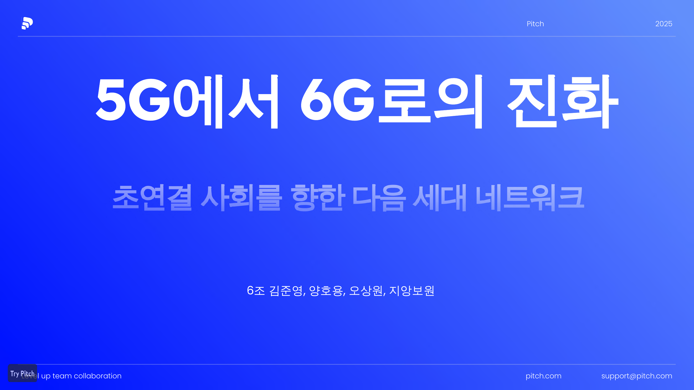
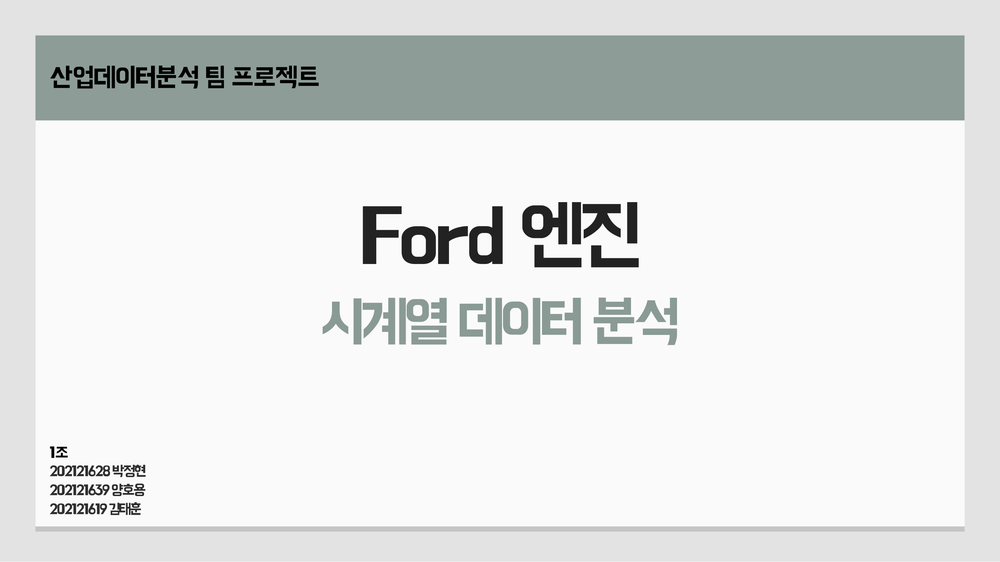

# School Projects Portfolio

학부 과정에서 진행한 팀 프로젝트와 수상 경험을 정리한 포트폴리오 저장소입니다.  
단순 결과물 나열이 아니라, 각 프로젝트에서 맡은 역할, 문제 해결 과정, 사용 기술, 결과물을 함께 확인할 수 있도록 구성했습니다.

## Projects

| Project | Type | Focus | Role |
| --- | --- | --- | --- |
| [5G to 6G Network Evolution](./network-evolution-portfolio) | Network Research | 5G/6G 기술 비교, 산업 적용 사례, 네트워크 발전 방향 | 팀장, 발표자료 구성, 기술 조사 및 정리 |
| [Ford Engine Fault Detection](./ford-engine-timeseries-portfolio) | Industrial Data Analysis | 센서 시계열 데이터 전처리, 이상 탐지, 머신러닝 모델 비교 | 데이터 전처리, 모델 실험, 결과 분석 |
| [Pronunciation-Based Japanese Translator](./pronunciation-translator-portfolio) | AI / NLP Service | 발음 기반 일본어 번역, Seq2Seq 모델, 서비스 화면 설계 | 모델 구현, 학습 구조 설계, 발표자료 제작 |
| [Debate Grand Prize Portfolio](./debate-award-portfolio) | Award / Debate | 온라인 플랫폼 공정화법 토론, 쟁점 분석, 논리 구성 | 토론 준비, 자료 조사, 찬성 측 논리 구성 |

## 1. 5G to 6G Network Evolution

[](./network-evolution-portfolio)

5G에서 6G로 이어지는 네트워크 기술 발전을 조사하고, 세대별 핵심 차이와 산업 적용 가능성을 정리한 팀 프로젝트입니다.  
단순 기술 소개가 아니라, 6G에서 중요해지는 초저지연, 초연결, AI 기반 네트워크, 산업별 활용 가능성을 중심으로 발표 흐름을 설계했습니다.

**Key Points**

- 5G와 6G의 구조적 차이 비교
- 6G 핵심 기술과 산업 적용 사례 정리
- 네트워크 발전 방향을 발표용 스토리라인으로 구성
- 팀장 역할로 자료 흐름과 발표 완성도 관리

**Keywords**  
`5G` `6G` `Network` `Wireless Communication` `AI Network` `Research Presentation`

## 2. Ford Engine Fault Detection

[](./ford-engine-timeseries-portfolio)

Ford 엔진 센서 데이터를 활용해 정상/이상 상태를 분류하는 산업데이터 분석 프로젝트입니다.  
시계열 센서 데이터의 특성을 고려해 전처리, 특징 추출, 모델 비교를 진행했고, 단순 정확도보다 실제 이상 탐지 문제에서 어떤 데이터 처리 방식이 의미 있는지에 초점을 맞췄습니다.

**Key Points**

- 센서 기반 시계열 데이터 전처리
- 특징 엔지니어링 및 학습 데이터 구성
- Logistic Regression 등 머신러닝 모델 실험
- 분석 결과를 발표자료와 코드로 함께 정리

**Keywords**  
`Industrial Data` `Time Series` `Fault Detection` `Machine Learning` `Python` `Data Preprocessing`

## 3. Pronunciation-Based Japanese Translator

[](./pronunciation-translator-portfolio)

일본어 표현을 정확히 모르더라도 발음 기반 입력을 통해 번역 결과를 얻을 수 있도록 설계한 AI 번역 프로젝트입니다.  
Seq2Seq 구조를 기반으로 모델 학습 흐름을 구성했고, 발표자료에서는 서비스 화면 설계와 실제 사용 시나리오까지 함께 정리했습니다.

**Key Points**

- 발음 기반 번역 문제 정의
- Seq2Seq 모델 구조 설계 및 구현
- 학습 데이터 처리와 모델 결과 정리
- 서비스 화면 설계 자료와 코드 포트폴리오 통합

**Keywords**  
`NLP` `Seq2Seq` `Japanese Translation` `Pronunciation` `Python` `AI Service Design`

## 4. Debate Grand Prize Portfolio

[](./debate-award-portfolio)

제12회 가톨릭대학생 토론대회에서 팀 `디벨이트`로 참가해 대상을 수상한 경험을 정리한 포트폴리오입니다.  
온라인 플랫폼 공정화법을 중심으로 찬반 쟁점을 분석하고, 플랫폼 사업자, 입점업체, 소비자 관점을 비교하며 찬성 측 논리를 구성했습니다.

**Key Points**

- 온라인 플랫폼 공정화법 관련 쟁점 조사
- 입점업체 보호, 수수료, 광고비, 노출 기준 문제 분석
- EU, 일본 등 해외 플랫폼 규제 사례 비교
- 수상 사진, 상장, 준비자료를 함께 정리

**Keywords**  
`Debate` `Grand Prize` `Platform Regulation` `Policy Analysis` `Argumentation` `Research`

## Repository Structure

```text
School-Projects/
├── README.md
├── network-evolution-portfolio/
├── ford-engine-timeseries-portfolio/
├── pronunciation-translator-portfolio/
└── debate-award-portfolio/
```

## About This Repository

이 저장소는 학교 프로젝트를 한 번에 보기 위한 허브 역할을 합니다.  
각 폴더에는 프로젝트별 README, 발표자료, 핵심 이미지, 코드 또는 준비자료가 포함되어 있으며, GitHub에서 바로 확인할 수 있도록 구성했습니다.

## Contact

- GitHub: [yongnyong](https://github.com/yongnyong)
